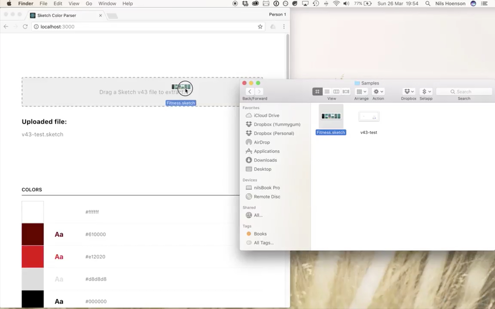

# Sketch Color Parser
Parses a Sketch v43+ file and outputs all colors used in the file.



**[Check it out.](https://nilshoenson.github.io/sketch-color-parser/)**

## Issues

Found something that shouldn't act the way it does? [Let me know](https://github.com/nilshoenson/sketch-color-parser/issues)

## Contribute

Want to help me out by contributing? Feel free to! For the repo and make a pull request.

``` bash
# Install dependencies
npm install

# Serve locally
npm start

# Build for production
npm run build
```